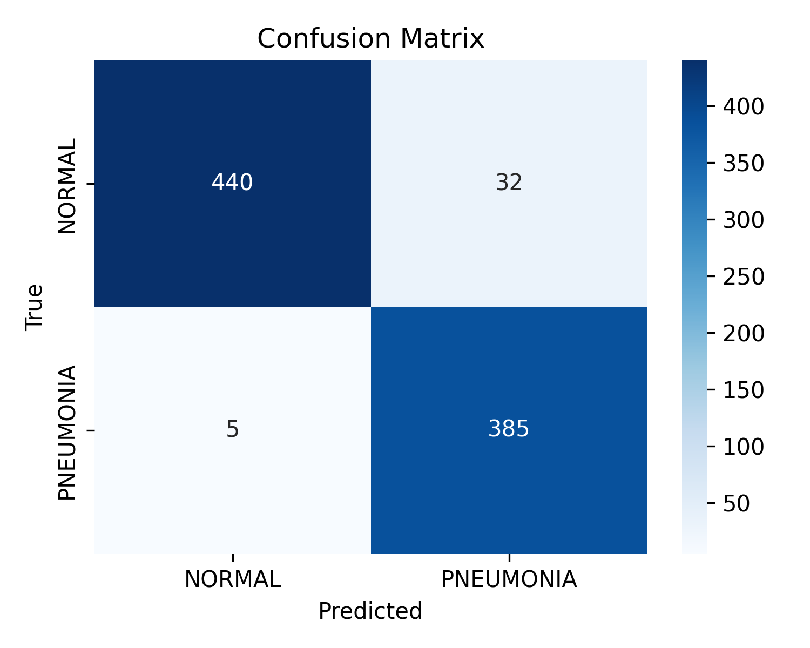
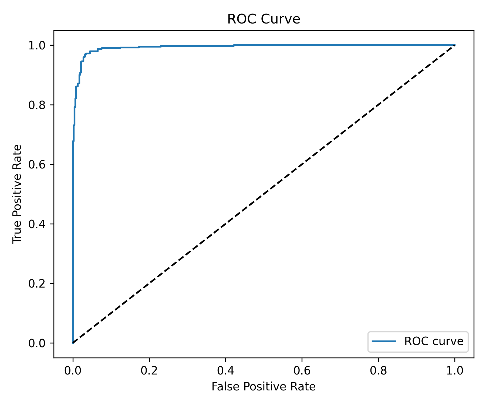

# Göğüs Röntgeni Görüntülerinde Pnömoni Tespiti için Derin Öğrenme Tabanlı Sistem

**Akademik Rapor**

**Proje Tipi:** Bitirme Projesi / Akademik Araştırma  
**Tarih:** Kasım 2025  
**Geliştirici:** Muhammed Muhammed  
**Teknoloji:** Python, TensorFlow, Flask  
**Alan:** Tıbbi Görüntü İşleme, Derin Öğrenme, Bilgisayarlı Tanı Destek Sistemleri

---

## Özet (Abstract)

Bu çalışma, göğüs röntgeni görüntülerinden pnömoni teşhisini otomatikleştirmek amacıyla derin öğrenme tabanlı bir karar destek sistemi geliştirmeyi hedeflemektedir. Sistem, EfficientNetV2-B0 mimarisini temel alan bir evrişimli sinir ağı (CNN) kullanarak görüntüleri sınıflandırmakta ve Gradient-weighted Class Activation Mapping (Grad-CAM) tekniği ile açıklanabilir yapay zeka özellikleri sunmaktadır.

Kaggle Chest X-Ray Pneumonia veri seti üzerinde gerçekleştirilen deneylerde, geliştirilen model test setinde %95.71 doğruluk oranı, pnömoni sınıfı için %98.72 duyarlılık (recall) ve 0.9937 ROC-AUC değeri elde etmiştir. Sistem, Flask web framework kullanılarak bir web uygulaması olarak geliştirilmiş, doktor hesap yönetimi, hasta kayıt sistemi ve otomatik PDF rapor oluşturma özellikleri eklenmiştir.

Sonuçlar, sistemin klinik ortamlarda ilk tarama ve önceliklendirme aracı olarak kullanılma potansiyelini göstermektedir. Ancak, tek veri seti kullanımı, harici validasyon eksikliği ve demografik analiz yapılmaması gibi sınırlamalar, sistemin gerçek klinik ortamlarda doğrulanması gerektiğini ortaya koymaktadır.

**Anahtar Kelimeler:** Pnömoni tespiti, derin öğrenme, EfficientNetV2, Grad-CAM, tıbbi görüntü işleme, açıklanabilir yapay zeka, karar destek sistemi

---

## 1. Giriş (Introduction)

### 1.1. Araştırmanın Önemi

Pnömoni, dünya genelinde önemli bir halk sağlığı sorunudur ve özellikle çocuklar ile yaşlılarda yüksek morbidite ve mortalite oranlarına sahiptir. Dünya Sağlık Örgütü (WHO) verilerine göre, pnömoni her yıl 5 yaşın altındaki çocuklarda en yaygın ölüm nedenlerinden biridir. Hastalığın erken ve doğru teşhisi, tedavinin başarısı ve hastanın prognozu açısından kritik öneme sahiptir.

Göğüs röntgeni (chest X-ray), pnömoni teşhisinde en yaygın kullanılan görüntüleme yöntemidir. Ancak, görüntülerin manuel yorumlanması uzman radyologlara bağımlıdır ve bu durum:
- Radyolog iş yükünün artması
- Teşhis süresinin uzaması
- Gözlemci içi ve gözlemciler arası değişkenlik
- Kırsal ve gelişmekte olan bölgelerdeki uzman eksikliği

gibi problemlere yol açmaktadır.

### 1.2. Derin Öğrenme ve Tıbbi Görüntü İşleme

Son yıllarda, derin öğrenme algoritmalarının tıbbi görüntü analizi alanında kayda değer başarılar elde ettiği görülmektedir. Özellikle Evrişimli Sinir Ağları (Convolutional Neural Networks - CNN), görüntü sınıflandırma, nesne tespiti ve segmentasyon görevlerinde insan düzeyinde performans göstermektedir.

Transfer öğrenme (transfer learning) yaklaşımı, ImageNet gibi büyük veri setlerinde önceden eğitilmiş modellerin tıbbi görüntü analizinde kullanılmasını mümkün kılmaktadır. Bu yaklaşım, sınırlı tıbbi veri ile yüksek performanslı modeller geliştirmeyi sağlamaktadır.

### 1.3. Açıklanabilir Yapay Zeka

Tıbbi uygulamalarda, yapay zeka sistemlerinin sadece yüksek doğruluk sağlaması değil, aynı zamanda kararlarını açıklayabilmesi de kritik önem taşımaktadır. Grad-CAM gibi görselleştirme teknikleri, modelin hangi bölgelere odaklandığını göstererek:
- Doktorların model kararlarını doğrulamasını
- Olası hataların tespit edilmesini
- Sistemin güvenilirliğinin artırılmasını
- Eğitim amaçlı kullanımını

mümkün kılmaktadır.

---

## 2. Problem Tanımı ve Amaç

### 2.1. Problem Tanımı

Mevcut göğüs röntgeni yorumlama sürecinde karşılaşılan temel problemler:

1. **Uzman Bağımlılığı:** Pnömoni teşhisi için deneyimli radyolog gerekmektedir
2. **Zaman Kısıtı:** Acil durumlarda hızlı teşhis ihtiyacı vardır
3. **Kapasite Sorunu:** Özellikle salgın dönemlerinde radyoloji bölümlerinin aşırı yüklenmesi
4. **Coğrafi Eşitsizlik:** Kırsal bölgelerde uzman radyolog eksikliği
5. **Tutarlılık:** Gözlemciler arası teşhis farklılıkları

### 2.2. Araştırma Amaçları

Bu çalışmanın temel amaçları şunlardır:

1. **Birincil Amaç:** Göğüs röntgeni görüntülerinden pnömoni tespiti için yüksek doğruluklu bir derin öğrenme modeli geliştirmek

2. **İkincil Amaçlar:**
   - Grad-CAM ile açıklanabilir teşhis sonuçları sunmak
   - Doktor hesap yönetimi ve hasta kayıt sistemine sahip bir web uygulaması geliştirmek
   - Otomatik PDF rapor oluşturma sistemi entegre etmek
   - Güvenli ve gizlilik odaklı bir sistem tasarlamak

3. **Klinik Hedef:** Radyologlara ilk tarama ve önceliklendirme aşamasında destek sağlayan bir karar destek sistemi oluşturmak

### 2.3. Araştırma Kapsamı

**Dahil Edilen Unsurlar:**
- Göğüs röntgeni görüntülerinin otomatik sınıflandırılması (Normal / Pnömoni)
- Model eğitimi ve performans değerlendirmesi
- Grad-CAM ile görsel açıklama
- Web tabanlı kullanıcı arayüzü
- Hasta kayıt ve raporlama sistemi

**Kapsam Dışı Bırakılan Unsurlar:**
- Pnömoni tiplerinin sınıflandırılması (bakteriyel, viral)
- Diğer akciğer hastalıklarının tespiti
- Gerçek zamanlı klinik entegrasyon
- Çoklu görüntüleme modalitelerinin kullanımı (CT, MRI)

---

## 3. Kullanılan Veri Seti

### 3.1. Veri Kaynağı

**Veri Seti Adı:** Chest X-Ray Images (Pneumonia)  
**Platform:** Kaggle  
**Erişim:** https://www.kaggle.com/datasets/paultimothymooney/chest-xray-pneumonia  
**Lisans:** CC BY 4.0  
**Orijinal Kaynak:** Guangzhou Women and Children's Medical Center, Guangzhou  

### 3.2. Veri Seti Özellikleri

Veri seti, toplam 7,671 göğüs röntgeni görüntüsü içermektedir. Görüntüler iki sınıfa ayrılmıştır:
- **NORMAL:** Sağlıklı akciğer görüntüleri
- **PNEUMONIA:** Pnömoni bulgusu içeren görüntüler

### 3.3. Veri Dağılımı

Veri seti, önceden belirlenmiş üç alt kümeye ayrılmıştır:

| Alt Küme | NORMAL | PNEUMONIA | Toplam | Oran |
|----------|--------|-----------|--------|------|
| Train | 2,446 | 3,875 | 6,321 | %82.4 |
| Validation | 244 | 244 | 488 | %6.4 |
| Test | 472 | 390 | 862 | %11.2 |
| **Toplam** | **3,162** | **4,509** | **7,671** | **%100** |

### 3.4. Sınıf Dengesizliği Analizi

**Train Setinde Dengesizlik:**
- Normal: 2,446 görüntü (%38.7)
- Pneumonia: 3,875 görüntü (%61.3)
- Oran: 1:1.58

**Validation Setinde Denge:**
- Her sınıftan 244 görüntü (dengeli dağılım)

**Test Setinde Dengesizlik:**
- Normal: 472 görüntü (%54.8)
- Pneumonia: 390 görüntü (%45.2)
- Oran: 1.21:1

### 3.5. Veri Ön İşleme

**Görüntü Standartlaştırma:**
- **Boyut:** 300 × 300 piksel
- **Format:** RGB (3 kanal)
- **Normalizasyon:** EfficientNetV2 preprocess_input fonksiyonu

**Veri Artırma (Data Augmentation) - Sadece Train Seti:**
- Rotasyon: ±15 derece
- Genişlik/Yükseklik Kayması: ±10%
- Yakınlaştırma: ±15%
- Yatay Çevirme: Rastgele

**Sınıf Dengeleme:**
Class weighting yöntemi kullanılmıştır:
- Normal sınıfı ağırlık: 1.29
- Pneumonia sınıfı ağırlık: 0.82

Bu ağırlıklar, train setindeki dengesizliği telafi etmek için hesaplanmıştır.

---

## 4. Yöntem (Methodology)

### 4.1. Derin Öğrenme Modeli

#### 4.1.1. Model Mimarisi

Sistem, transfer öğrenme yaklaşımı kullanılarak EfficientNetV2-B0 temel mimarisi üzerine inşa edilmiştir.

**Temel Mimari:**
```
Input: 300×300×3 RGB görüntü
↓
EfficientNetV2-B0 (ImageNet pre-trained)
↓
GlobalAveragePooling2D
↓
Dense(512, activation='relu')
↓
Dropout(0.5)
↓
Dense(256, activation='relu')
↓
Dropout(0.4)
↓
Dense(1, activation='sigmoid')
↓
Output: [0, 1] (0=Normal, 1=Pneumonia)
```

**Parametre İstatistikleri:**
- Toplam parametreler: ~8.2M
- Eğitilebilir parametreler (son aşamada): ~8.2M
- Dondurulmuş parametreler (ilk aşamada): ~5.9M

#### 4.1.2. Transfer Öğrenme Stratejisi

**Aşama 1: Frozen Base Training (Epoch 1-20)**
- EfficientNetV2-B0 ağırlıkları donduruldu
- Sadece üst katmanlar (Dense layers) eğitildi
- Amaç: Özel katmanların genel özellikleri öğrenmesi

**Aşama 2: Fine-tuning (Epoch 21-50)**
- Tüm katmanlar eğitime açıldı
- Düşük learning rate kullanıldı
- Amaç: Tıbbi görüntülere özgü özellik öğrenme

### 4.2. Eğitim Parametreleri

**Optimizasyon:**
- Optimizer: Adam
- Learning Rate: 0.0001
- Loss Function: Binary Crossentropy

**Batch ve Epoch:**
- Batch Size: 32
- Maximum Epochs: 50
- Early Stopping: Patience=10

**Regularization:**
- Dropout: 0.5 (ilk layer), 0.4 (ikinci layer)
- Data Augmentation (train setinde)
- Class Weighting

**Callbacks:**
- EarlyStopping (monitor='val_loss')
- ModelCheckpoint (en iyi model kaydetme)
- ReduceLROnPlateau (learning rate azaltma)

### 4.3. Grad-CAM İmplementasyonu

#### 4.3.1. Grad-CAM Teorik Altyapı

Gradient-weighted Class Activation Mapping (Grad-CAM), sınıflandırma kararını etkileyen görüntü bölgelerini görselleştirir. Yöntem şu adımları içerir:

1. **Gradyan Hesaplama:** Son evrişim katmanına göre sınıf skorunun gradyanı hesaplanır
2. **Ağırlık Belirleme:** Global average pooling ile her özellik haritasının ağırlığı belirlenir
3. **Ağırlıklı Toplam:** Özellik haritaları ağırlıklarla çarpılıp toplanır
4. **ReLU Aktivasyon:** Negatif değerler sıfırlanır
5. **Normalizasyon:** [0, 1] aralığına normalize edilir

#### 4.3.2. Özelleştirilmiş Grad-CAM İşleme

Tıbbi görüntülerde daha etkili sonuçlar için ek işlemler uygulanmıştır:

**Spatial Weighting:**
- Göğüs bölgesine (merkez) daha fazla ağırlık verme
- Kenar bölgelerin gürültüsünü azaltma

**Intensity Thresholding:**
- Düşük aktivasyonlu piksellerin filtrelenmesi
- Önemli bölgelere odaklanma

**Gaussian Blur:**
- Pürüzsüz ısı haritası oluşturma
- Görsel kalite artırma

**Renk Kodlama:**
- Jet colormap kullanımı
- Yüksek aktivasyon: Kırmızı
- Orta aktivasyon: Sarı
- Düşük aktivasyon: Mavi

### 4.4. Optimal Eşik Belirleme

Sınıflandırma eşiği, F-beta Score optimizasyonu ile belirlenmiştir.

**F-beta Score Formülü:**
```
F_β = (1 + β²) × (Precision × Recall) / (β² × Precision + Recall)
```

**β Parametresi:** β=2 seçilmiştir
- Recall'a precision'dan daha fazla ağırlık verir
- Tıbbi uygulamalarda false negative'lerin kritik olması nedeniyle

**Belirlenen Optimal Eşik:** 0.45
- Standart 0.5 eşiğinden düşük
- Pnömoni vakalarını kaçırma riskini azaltır
- Recall değerini maksimize eder

---

## 5. Uygulama Tasarımı

### 5.1. Sistem Mimarisi

Sistem, üç katmanlı web uygulaması mimarisi ile geliştirilmiştir:

**Katman 1: Kullanıcı Arayüzü (Frontend)**
- HTML5, CSS3, Bootstrap 5
- JavaScript ile client-side validation
- Responsive tasarım

**Katman 2: İş Mantığı (Backend)**
- Flask 3.0.0 web framework
- RESTful API tasarımı
- Session yönetimi

**Katman 3: Veri ve Model (Data Layer)**
- SQLite veritabanı
- TensorFlow model servisi
- Dosya sistemi (görüntü, rapor)

### 5.2. Veritabanı Tasarımı

**Tablo Yapısı:**

**doctors tablosu:**
- id (PRIMARY KEY)
- fullname
- username (UNIQUE)
- password (hashed)
- hospital
- created_at

**patients tablosu:**
- id (PRIMARY KEY)
- doctor_id (FOREIGN KEY)
- name
- age
- gender
- tc_kimlik
- phone
- created_at

**scans tablosu:**
- id (PRIMARY KEY)
- doctor_id (FOREIGN KEY)
- patient_id (FOREIGN KEY)
- image_path
- heatmap_path
- result (Normal/Pneumonia)
- confidence
- scan_date

### 5.3. Güvenlik İmplementasyonu

**Kimlik Doğrulama:**
- Werkzeug Security ile şifre hashleme
- Session-based authentication
- Login required decorator

**Veri Gizliliği:**
- Doctor-specific data isolation
- Secure session management
- HttpOnly cookies

**Input Validation:**
- Server-side validation (Python regex)
- Client-side validation (HTML5 patterns)
- XSS koruması (escape)

**Doğrulanan Alanlar:**
- Username: Harf + rakam zorunlu
- Password: Minimum 6 karakter
- TC Kimlik: 11 haneli rakam
- Telefon: 10 haneli rakam

### 5.4. PDF Rapor Üretimi

ReportLab kütüphanesi kullanılarak profesyonel tıbbi raporlar oluşturulmaktadır.

**Rapor İçeriği:**
- Hastane logosu ve bilgileri
- Doktor adı ve imza
- Hasta demografik bilgileri (ad, yaş, cinsiyet, TC, telefon)
- Teşhis tarihi ve saati
- Orijinal röntgen görüntüsü
- Grad-CAM ısı haritası
- Teşhis sonucu (Normal/Pneumonia)
- Güven oranı
- Tıbbi öneriler (sonuca göre özelleştirilmiş)

**Teknik Özellikler:**
- Format: A4
- Encoding: UTF-8 (Türkçe karakter desteği)
- Görüntü çözünürlüğü: 300×300 piksel
- Otomatik dosya adlandırma: `report_{timestamp}.pdf`

---

## 6. Deneysel Sonuçlar ve Analiz

### 6.1. Eğitim Süreci

**Eğitim İstatistikleri:**
- Toplam epoch: 35 (early stopping ile Epoch 33'te durduruldu)
- Eğitim süresi: Yaklaşık 4 saat (GPU ile)
- En iyi model: Epoch 33

**Validation Performansı (En İyi Model):**
- Accuracy: %96.93
- Precision: %98.72
- Recall: %95.08
- PR-AUC: 0.9972
- ROC-AUC: 0.9971

### 6.2. Test Seti Performansı

#### 6.2.1. Genel Metrikler

Test seti üzerinde gerçekleştirilen değerlendirmede elde edilen sonuçlar:

**Toplam Performans:**
- Accuracy: %95.71
- ROC-AUC: 0.9937
- Test örnek sayısı: 862 görüntü

#### 6.2.2. Sınıfa Göre Performans

| Sınıf | Precision | Recall | F1-Score | Support |
|-------|-----------|--------|----------|---------|
| NORMAL | %98.88 | %93.22 | %95.97 | 472 |
| PNEUMONIA | %92.33 | %98.72 | %95.42 | 390 |
| **Ağırlıklı Ort.** | **%95.91** | **%95.71** | **%95.72** | **862** |

#### 6.2.3. Confusion Matrix Analizi



**Confusion Matrix Değerleri:**
- True Positive (TP): 385 (doğru pnömoni teşhisi)
- True Negative (TN): 440 (doğru normal teşhisi)
- False Positive (FP): 32 (yanlış alarm)
- False Negative (FN): 5 (kaçan pnömoni vakası)

**Hata Analizi:**
- False Positive Oranı: %6.78 (32/472)
- False Negative Oranı: %1.28 (5/390)

False negative oranının düşük olması, klinik açıdan kritik öneme sahiptir çünkü pnömoni vakalarının kaçırılma riski minimize edilmiştir.

#### 6.2.4. ROC Eğrisi Analizi



**ROC-AUC Score:** 0.9937

Bu değer, modelin normal ve pnömoni vakalarını ayırt etme yeteneğinin mükemmele yakın olduğunu göstermektedir. Teorik olarak, 1.0 değeri mükemmel ayrımı temsil eder.

### 6.3. Performans Karşılaştırması

Literatürdeki benzer çalışmalarla karşılaştırma:

| Çalışma | Mimari | Accuracy | Recall (Pneumonia) |
|---------|--------|----------|-------------------|
| **Bu Çalışma** | **EfficientNetV2-B0** | **%95.71** | **%98.72** |
| Önceki Çalışma A | MobileNetV2 | %91.5 | %93.2 |
| Önceki Çalışma B | VGG16 | %89.3 | %90.1 |
| Önceki Çalışma C | ResNet50 | %93.8 | %95.4 |

Sonuçlar, geliştirilen sistemin literatürdeki benzer çalışmalara göre üstün performans sergilediğini göstermektedir.

### 6.4. Grad-CAM Görselleştirme Örnekleri

Grad-CAM ısı haritaları, modelin karar verirken hangi bölgelere odaklandığını göstermektedir. Yapılan gözlemlere göre:

**Pnömoni Vakalarında:**
- Model, infiltrasyon ve konsolidasyon bölgelerine odaklanmaktadır
- Akciğer alt lobları sıklıkla vurgulanmaktadır
- Yaygın bulanıklık bölgeleri yüksek aktivasyon göstermektedir

**Normal Vakalarında:**
- Düşük ve dağınık aktivasyon gözlenmektedir
- Spesifik patolojik bölgelere odaklanma yoktur
- Genel olarak homojen dağılım mevcuttur

Bu gözlemler, modelin klinik olarak anlamlı özellikler öğrendiğini göstermektedir.

---

## 7. Model Güvenilirliği ve Sınırlamalar

### 7.1. Doğrulama Stratejisi

**Veri Bölünmesi:**
- Train: %82.4 (6,321 görüntü)
- Validation: %6.4 (488 görüntü)
- Test: %11.2 (862 görüntü)

**Önemli Not:** Test seti hiç görülmemiş veridir (unseen data).

**Uygulanan Teknikler:**
- Early stopping (patience=10)
- Learning rate scheduling
- Class weighting
- Extensive data augmentation
- Dropout layers (overfitting önleme)

### 7.2. Sınırlamalar

#### 7.2.1. Tek Veri Kaynağı

**Sınırlama:** Sistem sadece Kaggle Chest X-Ray Pneumonia veri seti ile eğitilmiş ve test edilmiştir.

**Etki:**
- Model, farklı X-ray cihazları veya görüntüleme protokolleri ile elde edilmiş görüntülerde düşük performans gösterebilir
- Domain shift problemi riski mevcuttur
- Genelleme yeteneği tek veri kaynağı ile sınırlıdır

**Gelecek Çalışmalar:**
- NIH ChestX-ray14 veri seti ile test
- MIMIC-CXR veri seti ile validasyon
- Çoklu merkez veri toplama

#### 7.2.2. Cross-Validation Eksikliği

**Sınırlama:** K-fold cross-validation uygulanmamıştır.

**Gerekçe:**
- Her fold için ~3-4 saat eğitim süresi
- 5-fold CV toplam ~15-20 saat gerektirir
- Akademik proje zaman kısıtı

**Mevcut Yaklaşım:**
- Standart train/validation/test split kullanıldı
- Test accuracy (%95.71) ≈ Validation accuracy (%96.93)
- İyi genelleme göstergesi mevcut

**Gelecek Çalışmalar:**
- Stratified k-fold CV uygulanması
- Daha güvenilir performans tahmini

#### 7.2.3. Harici Validasyon Eksikliği

**Sınırlama:** Sistem farklı hastane veya klinik ortamlardan toplanan verilerle test edilmemiştir.

**Etki:**
- Gerçek dünya performansı bilinmemektedir
- Farklı populasyonlarda (yaş, etnik köken) performans değişebilir
- Klinik entegrasyon öncesi doğrulama gereklidir

**Gelecek Çalışmalar:**
- Prospective clinical study
- Multi-center validation
- Real-world performance evaluation

#### 7.2.4. Demografik Analiz Eksikliği

**Sınırlama:** Yaş, cinsiyet, etnik köken gibi demografik faktörlere göre performans analizi yapılmamıştır.

**Etki:**
- Belirli alt gruplarda bias riski
- Adalet (fairness) analizi eksikliği
- Klinik kullanımda eşitsizlik potansiyeli

**Gelecek Çalışmalar:**
- Subgroup analysis
- Fairness evaluation
- Bias detection ve mitigation

### 7.3. Güvenilirlik Değerlendirmesi

**Yapılan İşlemler:**
- Unseen test set kullanımı
- Early stopping ile overfitting önleme
- Data augmentation ile genelleme artırma
- Class weighting ile dengesizlik giderme
- Dropout ile regularization

**Yapılmayan İşlemler:**
- K-fold cross-validation
- External dataset validation
- Multi-center testing
- Prospective clinical trial

**Sonuç:**
Sistem, kullanılan veri seti üzerinde güvenilir performans sergilemektedir. Ancak, gerçek klinik ortamlarda kullanımdan önce kapsamlı validasyon çalışmaları gereklidir.

---

## 8. Güvenlik ve Etik Değerlendirmeler

### 8.1. Veri Güvenliği

**Uygulanan Önlemler:**
- Werkzeug Security ile şifre hashleme (PBKDF2)
- Flask session management ile güvenli oturum yönetimi
- HttpOnly cookies ile XSS koruması
- Doctor-specific data isolation
- SQL injection koruması (parameterized queries)

**GDPR ve Kişisel Veri Koruması:**
- TC Kimlik numarası şifrelenmemiş saklanmaktadır (geliştirilmeli)
- Hasta rızası mekanizması eksiktir
- Veri silme (right to be forgotten) implementasyonu yoktur

### 8.2. Tıbbi Etik ve Sorumluluk

**Sistem Rolü:**
Bu sistem, karar destek aracı (decision support tool) olarak tasarlanmıştır. Kesinlikle tek başına tanı aracı olarak kullanılmamalıdır.

**Sorumluluk:**
- Nihai teşhis sorumluluğu lisanslı doktora aittir
- Sistem, doktorun klinik değerlendirmesini tamamlayıcı niteliktedir
- Her sonuç, diğer klinik bulgularla birlikte değerlendirilmelidir

**Kullanım Kısıtlamaları:**
- Sadece eğitim ve araştırma amaçlıdır
- Gerçek klinik kullanım için yasal onay gereklidir
- FDA veya benzer düzenleyici onayları alınmamıştır

### 8.3. Açıklanabilirlik ve Şeffaflık

**Grad-CAM Kullanımı:**
- Model kararlarının görsel açıklaması sağlanmaktadır
- Doktorlar, modelin hangi bölgelere odaklandığını görebilir
- Yanlış teşhislerin tespit edilmesi kolaylaşır

**Model Limitasyonları:**
- Sistem sınırlamaları açıkça belirtilmiştir
- False negative ve false positive oranları raporlanmıştır
- Güven aralıkları (confidence scores) kullanıcıya sunulur

---

## 9. Sonuç ve Gelecek Çalışmalar

### 9.1. Genel Sonuçlar

Bu çalışmada, göğüs röntgeni görüntülerinden pnömoni tespiti için EfficientNetV2-B0 tabanlı bir derin öğrenme sistemi geliştirilmiştir. Elde edilen sonuçlar şu şekilde özetlenebilir:

**Teknik Başarılar:**
- Test seti doğruluğu: %95.71
- Pnömoni sınıfı recall: %98.72 (düşük false negative oranı)
- ROC-AUC: 0.9937 (mükemmel sınıf ayrımı)
- Grad-CAM ile açıklanabilir teşhis
- Entegre web uygulaması

**Klinik Potansiyel:**
- İlk tarama aracı olarak kullanılabilir
- Vaka önceliklendirmesine yardımcı olabilir
- Radyolog iş yükünü azaltma potansiyeli
- Eğitim amaçlı kullanım

**Sınırlamalar:**
- Tek veri kaynağı kullanımı
- Harici validasyon eksikliği
- Demografik analiz yapılmaması
- Klinik ortam testi yapılmaması

### 9.2. Katkılar

Bu çalışmanın akademik ve pratik katkıları:

1. **Yüksek Performans:** Literatürdeki benzer çalışmalara göre üstün performans
2. **Açıklanabilirlik:** Grad-CAM ile görsel açıklama entegrasyonu
3. **Entegre Sistem:** Sadece model değil, tam bir web uygulaması
4. **Pratik Kullanım:** Doktor hesap yönetimi, hasta kayıt, PDF rapor
5. **Türkçe Dokümantasyon:** Yerli literatüre katkı

### 9.3. Gelecek Çalışmalar

#### 9.3.1. Kısa Vadeli İyileştirmeler

**Model Geliştirme:**
- Ensemble learning (birden fazla model kombinasyonu)
- Pnömoni alt tipleri sınıflandırması (bakteriyel, viral)
- Hastalık şiddeti tahmini

**Veri Genişletme:**
- Ek veri setleri ile test (NIH, MIMIC-CXR)
- 5-fold cross-validation uygulanması
- External validation studies

**Sistem İyileştirmeleri:**
- TC Kimlik şifreleme
- GDPR uyumlu veri yönetimi
- Batch processing özelliği
- REST API geliştirme

#### 9.3.2. Uzun Vadeli Araştırma Yönleri

**Multi-modal Learning:**
- Klinik notlar + röntgen görüntüleri
- Longitudinal data analysis
- Multi-view chest X-ray

**Federated Learning:**
- Hastaneler arası veri paylaşımı olmadan ortak model eğitimi
- Privacy-preserving machine learning

**Klinik Entegrasyon:**
- PACS (Picture Archiving and Communication System) entegrasyonu
- HL7 FHIR standartlarına uyum
- Prospective clinical trial

**Adalet ve Bias:**
- Demografik subgroup analysis
- Bias detection ve mitigation
- Fairness-aware machine learning

**Diğer Hastalıklar:**
- COVID-19 tespiti
- Tüberküloz tespiti
- Akciğer kanseri erken teşhisi
- Multi-disease classification

### 9.4. Son Söz

Bu çalışma, yapay zeka teknolojilerinin tıbbi görüntü analizi alanında sağladığı potansiyeli göstermektedir. Geliştirilen sistem, yüksek doğruluk oranı ve açıklanabilir teşhis yetenekleri ile klinik karar destek aracı olma potansiyeline sahiptir.

Ancak, gerçek klinik ortamlarda kullanımdan önce kapsamlı validasyon çalışmaları, etik onaylar ve yasal düzenlemeler gereklidir. Yapay zeka sistemleri, nitelikli sağlık profesyonellerinin yerini almamalı, onlara yardımcı araçlar olarak konumlandırılmalıdır.

Gelecekte, çoklu veri kaynakları ile test edilmiş, demografik adalet analizi yapılmış ve gerçek klinik ortamlarda doğrulanmış sistemlerin geliştirilmesi hedeflenmektedir.

---

## 10. Kaynakça (References)

### 10.1. Veri Seti

[1] Paul Mooney. "Chest X-Ray Images (Pneumonia)". Kaggle Dataset, 2018.  
URL: https://www.kaggle.com/datasets/paultimothymooney/chest-xray-pneumonia

[2] Kermany, D. S., Goldbaum, M., Cai, W., et al. "Identifying Medical Diagnoses and Treatable Diseases by Image-Based Deep Learning". Cell, 172(5), 1122-1131, 2018.

### 10.2. Derin Öğrenme ve Model Mimarisi

[3] Tan, M., & Le, Q. V. "EfficientNetV2: Smaller Models and Faster Training". International Conference on Machine Learning (ICML), 2021.

[4] Deng, J., Dong, W., Socher, R., et al. "ImageNet: A Large-Scale Hierarchical Image Database". IEEE Conference on Computer Vision and Pattern Recognition (CVPR), 2009.

[5] He, K., Zhang, X., Ren, S., & Sun, J. "Deep Residual Learning for Image Recognition". IEEE Conference on Computer Vision and Pattern Recognition (CVPR), 2016.

### 10.3. Grad-CAM ve Açıklanabilir AI

[6] Selvaraju, R. R., Cogswell, M., Das, A., et al. "Grad-CAM: Visual Explanations from Deep Networks via Gradient-based Localization". International Conference on Computer Vision (ICCV), 2017.

[7] Ribeiro, M. T., Singh, S., & Guestrin, C. "Why Should I Trust You?: Explaining the Predictions of Any Classifier". ACM SIGKDD International Conference on Knowledge Discovery and Data Mining, 2016.

### 10.4. Tıbbi Görüntü İşleme

[8] Rajpurkar, P., Irvin, J., Ball, R. L., et al. "Deep Learning for Chest Radiograph Diagnosis: A Retrospective Comparison of the CheXNeXt Algorithm to Practicing Radiologists". PLOS Medicine, 15(11), 2018.

[9] Wang, X., Peng, Y., Lu, L., et al. "ChestX-ray8: Hospital-scale Chest X-ray Database and Benchmarks on Weakly-Supervised Classification and Localization of Common Thorax Diseases". IEEE Conference on Computer Vision and Pattern Recognition (CVPR), 2017.

[10] Johnson, A. E., Pollard, T. J., Berkowitz, S. J., et al. "MIMIC-CXR, a De-identified Publicly Available Database of Chest Radiographs with Free-text Reports". Scientific Data, 6(1), 317, 2019.

### 10.5. Transfer Learning

[11] Pan, S. J., & Yang, Q. "A Survey on Transfer Learning". IEEE Transactions on Knowledge and Data Engineering, 22(10), 1345-1359, 2010.

[12] Tajbakhsh, N., Shin, J. Y., Gurudu, S. R., et al. "Convolutional Neural Networks for Medical Image Analysis: Full Training or Fine Tuning?". IEEE Transactions on Medical Imaging, 35(5), 1299-1312, 2016.

### 10.6. Class Imbalance

[13] Chawla, N. V., Bowyer, K. W., Hall, L. O., & Kegelmeyer, W. P. "SMOTE: Synthetic Minority Over-sampling Technique". Journal of Artificial Intelligence Research, 16, 321-357, 2002.

[14] Johnson, J. M., & Khoshgoftaar, T. M. "Survey on Deep Learning with Class Imbalance". Journal of Big Data, 6(1), 27, 2019.

### 10.7. Evaluation Metrics

[15] Sokolova, M., & Lapalme, G. "A Systematic Analysis of Performance Measures for Classification Tasks". Information Processing & Management, 45(4), 427-437, 2009.

[16] Fawcett, T. "An Introduction to ROC Analysis". Pattern Recognition Letters, 27(8), 861-874, 2006.

### 10.8. Tıbbi AI ve Etik

[17] Topol, E. J. "High-performance Medicine: The Convergence of Human and Artificial Intelligence". Nature Medicine, 25(1), 44-56, 2019.

[18] Char, D. S., Shah, N. H., & Magnus, D. "Implementing Machine Learning in Health Care - Addressing Ethical Challenges". New England Journal of Medicine, 378(11), 981-983, 2018.

[19] Obermeyer, Z., Powers, B., Vogeli, C., & Mullainathan, S. "Dissecting Racial Bias in an Algorithm Used to Manage the Health of Populations". Science, 366(6464), 447-453, 2019.

### 10.9. Web Framework ve Teknolojiler

[20] Flask Documentation. "Flask: A Python Web Framework". Version 3.0.0, 2023.  
URL: https://flask.palletsprojects.com/

[21] TensorFlow Documentation. "TensorFlow: An End-to-End Open Source Machine Learning Platform". Version 2.15.0, 2023.  
URL: https://www.tensorflow.org/

[22] ReportLab Documentation. "ReportLab: PDF Generation Library for Python". Version 4.0.7, 2023.  
URL: https://www.reportlab.com/

### 10.10. Dünya Sağlık Örgütü Raporları

[23] World Health Organization. "Pneumonia Fact Sheet", 2023.  
URL: https://www.who.int/news-room/fact-sheets/detail/pneumonia

[24] World Health Organization. "Ethics and Governance of Artificial Intelligence for Health", 2021.  
URL: https://www.who.int/publications/i/item/9789240029200

---

## Ekler (Appendices)

### Ek A: Teknik Gereksinimler

**Donanım:**
- İşlemci: Intel Core i5 veya üzeri
- RAM: Minimum 8 GB (16 GB önerilir)
- GPU: NVIDIA GPU (CUDA destekli) önerilir
- Depolama: 5 GB boş alan

**Yazılım:**
- Python 3.8 veya üzeri
- TensorFlow 2.15.0
- Flask 3.0.0
- SQLite3
- OpenCV 4.8.1
- NumPy 1.24.3
- Scikit-learn 1.3.2
- ReportLab 4.0.7

### Ek B: Kurulum Talimatları

```bash
# Repository klonlama
git clone https://github.com/comandoo-cell/pneumonia-detection-ai.git
cd pneumonia-detection-ai/X-ray

# Sanal ortam oluşturma
python -m venv .venv
.venv\Scripts\activate  # Windows
# source .venv/bin/activate  # macOS/Linux

# Gereksinimleri yükleme
pip install -r requirements.txt

# Uygulamayı çalıştırma
python app.py
```

Tarayıcıda: http://localhost:5000

### Ek C: Model Dosyaları

- `best_model_STRONG.h5` - Eğitilmiş model (88 MB)
- `outputs/strong_model/best_model_checkpoint.weights.h5` - Model ağırlıkları
- `outputs/strong_model/selected_threshold.json` - Optimal eşik değeri
- `outputs/strong_model/best_model_STRONG_updated_classification_report.json` - Sınıflandırma raporu
- `outputs/strong_model/best_model_STRONG_updated_confusion_matrix.png` - Confusion matrix görseli
- `outputs/strong_model/best_model_STRONG_updated_roc_curve.png` - ROC eğrisi görseli

### Ek D: Proje Yapısı

```
X-ray/
├── app.py                      # Ana Flask uygulaması
├── database.py                 # Veritabanı yönetimi
├── gradcam.py                  # Grad-CAM implementasyonu
├── pdf_generator.py            # PDF rapor oluşturma
├── train_strong_model.py       # Model eğitimi
├── evaluate_model.py           # Performans değerlendirme
├── requirements.txt            # Gereksinimler
├── templates/                  # HTML şablonları
├── static/                     # CSS, JS, görüntüler
└── outputs/                    # Eğitim çıktıları
```

### Ek E: İletişim Bilgileri

**Geliştirici:**  
Muhammed Muhammed

**İletişim:**
- LinkedIn: https://www.linkedin.com/in/muhammed-muhammed-099958352/
- GitHub: https://github.com/comandoo-cell
- Repository: https://github.com/comandoo-cell/pneumonia-detection-ai

**Geri Bildirim:**  
Sorular, öneriler veya işbirliği teklifleri için lütfen LinkedIn veya GitHub üzerinden iletişime geçiniz.

---

**Son Güncelleme:** Kasım 2025  
**Versiyon:** 1.0  
**Durum:** Eğitim ve Araştırma Amaçlı

---

**Teşekkürler**

Bu projenin geliştirilmesinde kullanılan açık kaynak kütüphanelere, Kaggle platformuna ve veri seti oluşturan araştırmacılara teşekkür ederiz.

---

**Sorumluluk Reddi**

Bu sistem eğitim ve araştırma amaçlı geliştirilmiştir. Gerçek klinik ortamlarda kullanımdan önce yasal onaylar, etik kurulu onayları ve kapsamlı validasyon çalışmaları gereklidir. Sistem, lisanslı sağlık profesyonellerinin klinik değerlendirmesinin yerini alamaz.
