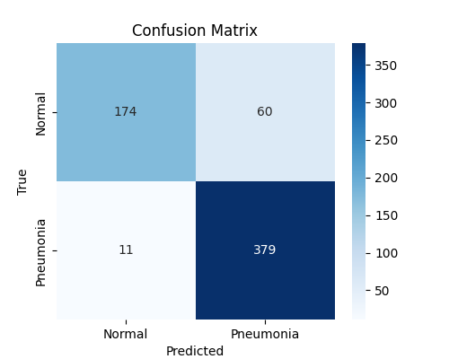
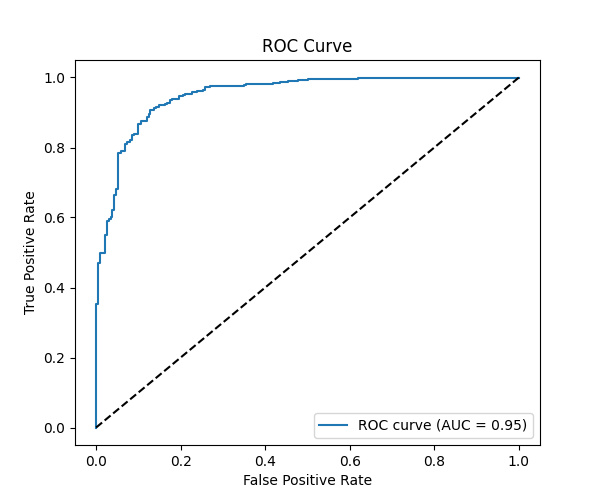
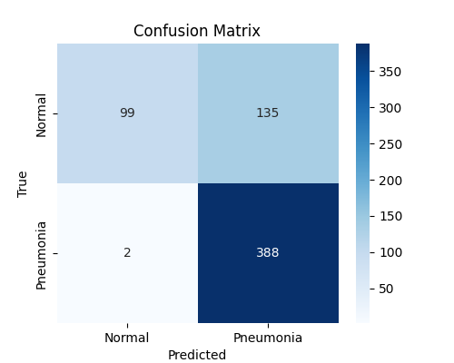
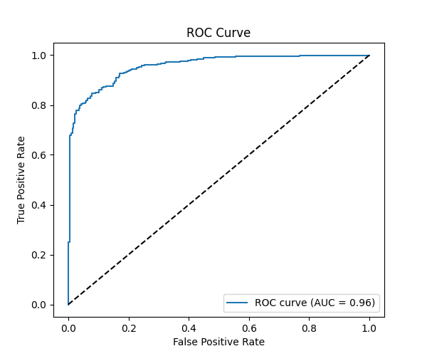

# مقارنة وتقييم النماذج (Pneumonia Detection)

تم تحديث هذا الملخص في 1 تشرين الثاني 2025 بعد تشغيل `evaluate_model.py` على مجموعة الاختبار الرسمية `chest_xray/test`.

## ملخص سريع
- النموذج المعتمد حاليا هو `best_model_NEW_TEST.h5`، وهو المستخدم داخل تطبيق Flask.
- النموذج الاقدم `best_model.h5` ما زال متوفرا للرجوع اليه، لكنه ينتج عددا اكبر من حالات القبول الخاطئ لفئة Normal.
- كلا النموذجين يستخدمان بنية MobileNetV2 بحجم ادخال 224x224 وتم تدريبهما على نفس البيانات.

## نتائج التقييم (Test Set)

| النموذج | Accuracy | Precision | Recall | F1-score | ROC AUC |
|---------|----------|-----------|--------|----------|---------|
| `best_model.h5` | 78.0% | 74.2% | 99.5% | 85.0% | 95.7% |
| `best_model_NEW_TEST.h5` | 88.6% | 86.3% | 97.2% | 91.4% | 95.1% |

- التحسن الاكبر يظهر في فئة Normal حيث انخفضت الاخطاء من 135 الى 60 صورة خاطئة، بينما بقيت حساسية فئة Pneumonia مرتفعة.
- F1-score حسب الفئة: النموذج القديم Normal = 0.59 / Pneumonia = 0.85، النموذج الجديد Normal = 0.83 / Pneumonia = 0.91.
- اختلاف بسيط في ROC AUC، لكن التوازن العام للنموذج الجديد يجعله الخيار الموصى به للاستخدام السريري المساعد.

## مصفوفات الالتباس

| النموذج | الصورة |
|---------|--------|
| `best_model.h5` |  |
| `best_model_NEW_TEST.h5` |  |

## منحنيات ROC

| النموذج | الصورة |
|---------|--------|
| `best_model.h5` |  |
| `best_model_NEW_TEST.h5` |  |

> في حال تعذر عرض الصور على GitHub، تأكد من تحميل الملف كاملا او استعرضه محليا.

## كيفية اعادة التقييم

1. فعّل البيئة الافتراضية: `venv\\Scripts\\activate` (او استخدم البيئة التي تم اعدادها مسبقا).
2. نفّذ:
   ```bash
   python evaluate_model.py
   ```
3. سيتم تحميل النموذج المحدد في الملف وتوليد التقرير النصي، المصفوفة، ومنحنى ROC.
4. لتبديل النموذج قم بتعديل المتغير `model_path` داخل `evaluate_model.py`.

## نشر النموذج

- الملف `best_model_NEW_TEST.h5` مرفوع داخل المستودع ويمكن استخدامه مباشرة في التطبيق (`app.py`).
- النموذج القديم `best_model.h5` يبقى للاختبارات المستقبلية او المقارنات الاضافية.
- ايقونة `static/heatmaps/` ستستقبل مخرجات Grad-CAM عند تشغيل التطبيق.

## ملاحظات عامة

- هذا المشروع يهدف الى دعم الاطباء ولا يغني عن التشخيص السريري.
- لا ينصح باستخدام النماذج كما هي في اجراءات طبية حقيقية من دون مراجعة مختص.
