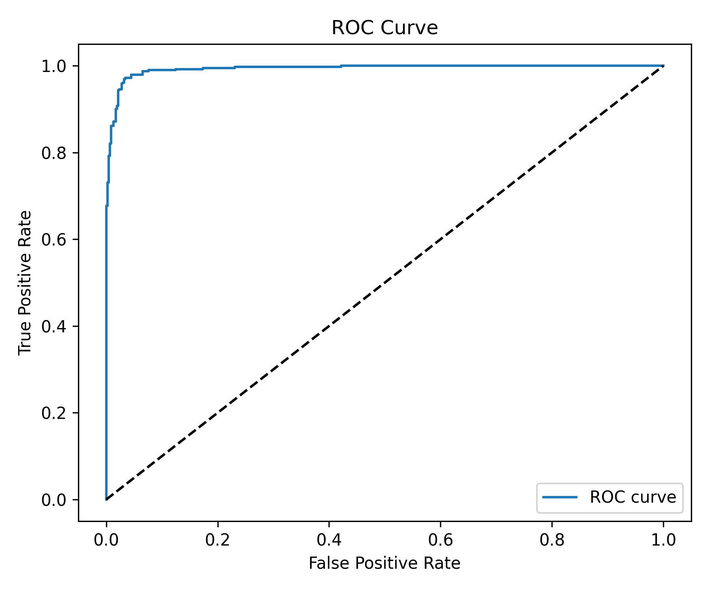

# 🩺 Pnömoni Tespit Sistemi (Pneumonia Detection System)

Göğüs röntgeni görüntülerinden pnömoni teşhisi için gelişmiş yapay zeka sistemi. Flask tabanlı, güvenli doktor oturum yönetimi, özelleştirilmiş kontrol panelleri ve profesyonel tıbbi raporlar içerir.

[](https://www.python.org/downloads/)
[](https://tensorflow.org)
[](https://flask.palletsprojects.com/)
[](LICENSE)

---

## 🚀 Hızlı Başlangıç (Quick Start)

### ⚡ Hızlı Kurulum

```bash
# 1. Projeyi klonlayın
git clone https://github.com/comandoo-cell/pneumonia-detection-ai.git
cd pneumonia-detection-ai/X-ray

# 2. Gereksinimleri yükleyin
pip install -r requirements.txt

# 3. Uygulamayı çalıştırın
python app.py

# 4. Tarayıcıyı açın
# http://localhost:5000
```

**Not:** Eğitilmiş model `best_model_STRONG.h5` projede mevcut, ek dosya indirmeye gerek yok.

### 📝 İlk Kullanım Adımları

1. **Doktor Hesabı Oluşturun**
   - `/register` sayfasına gidin
   - Ad, kullanıcı adı, şifre girin
   - (Opsiyonel) Hastane adı ekleyin

2. **Giriş Yapın**
   - Kullanıcı adı ve şifre ile giriş yapın

3. **X-ray Görüntüsü Yükleyin**
   - Ana sayfada "Dosya Seç" veya sürükle-bırak
   - PNG, JPG, JPEG formatları desteklenir

4. **Hasta Bilgilerini Girin** (Opsiyonel)
   - Ad, yaş, cinsiyet, TC Kimlik No, telefon

5. **Analiz Edin ve Sonuçları Görün**
   - Otomatik AI analizi
   - Grad-CAM görselleştirme
   - PDF rapor indirme

### 🧪 Model'i Tek Başına Test Etme

```python
# Tek bir görüntüyü test etmek için:
import tensorflow as tf
from tensorflow.keras.preprocessing import image
import numpy as np

# Model yükle
model = tf.keras.models.load_model('best_model_STRONG.h5')

# Görüntü yükle ve hazırla
img_path = 'test_image.jpg'
img = image.load_img(img_path, target_size=(300, 300))
img_array = image.img_to_array(img)
img_array = np.expand_dims(img_array, axis=0)
img_array = tf.keras.applications.efficientnet_v2.preprocess_input(img_array)

# Tahmin
prediction = model.predict(img_array)[0][0]

# Sonuç
threshold = 0.45
if prediction >= threshold:
    print(f"🔴 PNEUMONIA - Güven: {prediction*100:.2f}%")
else:
    print(f"🟢 NORMAL - Güven: {(1-prediction)*100:.2f}%")
```

---

## 📑 İçindekiler

- [Ana Özellikler](#-ana-özellikler)
- [Teknik Mimari](#️-teknik-mimari)
- [Kurulum ve Yapılandırma](#-kurulum-ve-yapılandırma)
- [Çalıştırma](#️-çalıştırma)
- [Proje Yapısı](#-proje-yapısı)
- [Arayüzler](#-arayüzler)
- [Performans Sonuçları](#-performans-sonuçları)
- [Değerlendirme ve Test](#-değerlendirme-ve-test)
- [Güvenlik ve Gizlilik](#-güvenlik-ve-gizlilik)
- [Geliştirme ve Bakım](#️-geliştirme-ve-bakım)
- [Sorun Giderme](#-sorun-giderme-troubleshooting)
- [Sık Sorulan Sorular](#-sık-sorulan-sorular-faq)

---

## 📊 Hızlı Performans Sonuçları

| Metrik | Değer |
|--------|-------|
| **Accuracy** | 95.71% |
| **Recall (Pneumonia)** | 98.72% |
| **Precision (Normal)** | 98.88% |
| **ROC-AUC** | 0.9937 |

---

## 📁 Veri Seti Bilgileri (Dataset Information)

### 📊 Veri Kaynağı
- **Dataset**: Chest X-Ray Images (Pneumonia)
- **Kaynak**: [Kaggle - Chest X-Ray Pneumonia Dataset](https://www.kaggle.com/datasets/paultimothymooney/chest-xray-pneumonia)
- **Lisans**: CC BY 4.0
- **Toplam Görüntü**: 5,863 göğüs röntgeni görüntüsü

### 📈 Veri Dağılımı

| Set | NORMAL | PNEUMONIA | Toplam |
|-----|--------|-----------|--------|
| **Train** | 2,446 | 3,875 | 6,321 |
| **Validation** | 244 | 244 | 488 |
| **Test** | 472 | 390 | 862 |
| **Toplam** | 3,162 | 4,509 | 7,671 |

### ⚖️ Sınıf Dengeleme
- **Train Set Dengesizlik**: ~1:1.58 (Normal:Pneumonia)
- **Çözüm**: Class weighting kullanıldı
  - Normal: 1.29 ağırlık
  - Pneumonia: 0.82 ağırlık
- **Data Augmentation**: Rotation, shift, zoom, flip

### 🔬 Veri Ön İşleme
- **Görüntü Boyutu**: 300×300 piksel
- **Normalizasyon**: EfficientNetV2 preprocess_input
- **Format**: RGB (3 kanal)
- **Augmentation**: 
  - Rotation: ±15°
  - Width/Height Shift: ±10%
  - Zoom: ±15%
  - Horizontal Flip

---

## ✨ Ana Özellikler

### 🔐 Güvenli Doktor Hesap Yönetimi
- Şifrelenmiş giriş sistemi
- Otomatik oturum yönetimi
- Arayüzde oturum durumu gösterimi
- Her doktor sadece kendi kayıtlarını görür

### 🎯 Modern ve Kullanıcı Dostu Arayüz
- Bootstrap ile modern tasarım
- İnteraktif kontrol panelleri
- Başarı ve hata bildirimleri
- Responsive tasarım

### 🧠 Güçlü ve Açıklanabilir Yapay Zeka
- Yüksek doğrulukla eğitilmiş EfficientNetV2 modeli
- **Grad-CAM** tekniği ile teşhis bölgelerinin görselleştirilmesi
- Orijinal görüntü ve ısı haritası yan yana gösterim
- Her teşhis için güven oranı

### 📄 Profesyonel PDF Raporları
- Tek sayfalık kapsamlı tıbbi rapor
- Hastane ve doktor bilgileri
- Hasta verileri (ad, yaş, cinsiyet, kimlik no)
- Teşhis sonucu ve güven oranı
- Sonuca göre özelleştirilmiş tıbbi öneriler
- Orijinal görüntü ve Grad-CAM haritası
- Hastane logosu ve doktor mührü

### 📊 Entegre Veritabanı
- Hasta ve tarama verilerini kaydetme
- Önceki raporların tam kaydı
- Gelişmiş arama ve filtreleme
- Her doktor için kapsamlı istatistikler

---

## 🏗️ Teknik Mimari

### 🤖 Derin Öğrenme Modeli
- **Mimari**: EfficientNetV2-B0 ile özel katmanlar
- **Eğitim**: 
  - İki aşamalı kademeli eğitim (Frozen Base + Fine-tuning)
  - Gelişmiş Data Augmentation
  - Denge için Class Weighting
  - Early Stopping & Learning Rate Scheduling
- **Performans**: False Positives'i azaltan yüksek doğruluk
- **Optimal Eşik**: F-beta Score kullanılarak otomatik belirleme

### 🔬 Açıklama için Grad-CAM
- En iyi katmanın akıllı seçimi
- Önemli bölgelere odaklanma algoritması
- Gelişmiş filtrelerle harita işleme:
  - Spatial Weighting (göğüs merkezine odaklanma)
  - Intensity Thresholding
  - Pürüzsüzlük için Gaussian Blur
- Kolay yorumlama için net renk tonları

### 💾 Veritabanı
- **Tür**: Yerel SQLite
- **Tablolar**:
  - `doctors`: Doktor ve hastane verileri
  - `patients`: Hasta bilgileri
  - `scans`: Tarama ve teşhis kayıtları
  - `statistics`: Genel istatistikler
- **Güvenlik**: Şifre şifreleme, doktor veri izolasyonu

---

## 🚀 Kurulum ve Yapılandırma

### Gereksinimler
- Python 3.8+
- pip
- Git

### Kurulum Adımları

```bash
# Projeyi klonlayın
git clone https://github.com/comandoo-cell/pneumonia-detection-ai.git
cd pneumonia-detection-ai/X-ray

# Sanal ortam oluşturun
python -m venv .venv

# Sanal ortamı etkinleştirin
# Windows'ta:
.venv\Scripts\activate
# macOS/Linux'ta:
# source .venv/bin/activate

# Gerekli kütüphaneleri yükleyin
pip install -r requirements.txt
```

### ⚙️ Yapılandırma

1. **Model**: `best_model_STRONG.h5` dosyası projede mevcut
2. **Veritabanı**: İlk çalıştırmada otomatik oluşturulur
3. **Ortam Değişkenleri** (opsiyonel):
   ```bash
   # .env dosyası oluşturulabilir
   SECRET_KEY=your-secret-key-here
   ```

---

## ▶️ Çalıştırma

```bash
# Uygulamayı çalıştırın
python app.py
```

Tarayıcıda açın: **http://localhost:5000**

### İlk Adımlar:
1. Kayıt sayfasından yeni doktor hesabı oluşturun
2. Giriş yapın:
   - Tam ad
   - Kullanıcı adı (benzersiz)
   - Şifre
   - Hastane adı (opsiyonel)
3. Kontrol paneline giriş yapın
4. Göğüs röntgeni görüntüsü yükleyin
5. Hasta verilerini girin
6. Teşhis ve Grad-CAM haritasını alın
7. PDF formatında tıbbi raporu indirin

---

## 📂 Proje Yapısı

```
X-ray/
│
├── app.py                      # Ana Flask uygulaması
├── database.py                 # Veritabanı yönetimi
├── gradcam.py                  # Grad-CAM harita oluşturma
├── pdf_generator.py            # PDF rapor oluşturma
├── train_strong_model.py       # Model eğitimi
├── evaluate_model.py           # Performans değerlendirme
├── requirements.txt            # Gerekli kütüphaneler
│
├── templates/                  # HTML şablonları
│   ├── login.html
│   ├── register.html
│   ├── index.html
│   ├── dashboard.html
│   ├── result.html
│   └── history.html
│
├── static/                     # Statik dosyalar
│   ├── css/styles.css
│   ├── js/scripts.js
│   ├── uploads/                # Yüklenen görüntüler
│   ├── heatmaps/               # Grad-CAM haritaları
│   ├── reports/                # PDF raporları
│   └── photo/logo.png
│
├── outputs/                    # Eğitim çıktıları
│   └── strong_model/
│       ├── best_model_checkpoint.weights.h5
│       ├── best_model_STRONG_updated_classification_report.json
│       ├── best_model_STRONG_updated_confusion_matrix.png
│       ├── best_model_STRONG_updated_roc_curve.png
│       └── selected_threshold.json
│
└── best_model_STRONG.h5        # Eğitilmiş nihai model
```

---

## 🎨 Arayüzler

### 📱 Kontrol Paneli
- Kapsamlı istatistikler
- Son taramalar
- Son hasta listesi
- İnteraktif grafikler

### 🔍 Sonuç Sayfası
- Orijinal görüntü
- Renkli Grad-CAM haritası
- Teşhis sonucu (normal / pnömoni)
- Güven oranı
- Tarih ve saat
- Rapor indirme butonu

### 📜 Tarama Geçmişi
- Tüm taramaların kapsamlı tablosu
- Gelişmiş arama
- Sonuca göre filtreleme
- Sıralama seçenekleri

---

## 📈 Performans Sonuçları

### 🎯 Nihai Eğitim Sonuçları

**Eğitim Bilgileri:**
- **Eğitim Tarihi**: Kasım 2025
- **Epoch Sayısı**: 35 (Epoch 33'te erken durdurma)
- **Optimal Eşik**: 0.45 (F-beta Score ile optimize edildi)

**Validation Performansı:**
- ✅ **Accuracy**: 96.93%
- ✅ **Precision**: 98.72%
- ✅ **Recall**: 95.08%
- ✅ **PR-AUC**: 0.9972
- ✅ **ROC-AUC**: 0.9971

---

### 🏆 Test Sonuçları (Test Set)

#### Genel Sonuçlar
- **Toplam Model Doğruluğu (Accuracy)**: **95.71%**
- **ROC-AUC Score**: **0.9937** (mükemmel performans)
- **Test Edilen Örnek Sayısı**: 862 görüntü

#### Sınıfa Göre Performans

| Sınıf | Precision | Recall | F1-Score | Support |
|-------|-----------|--------|----------|---------|
| **NORMAL (Normal)** | 98.88% | 93.22% | 95.97% | 472 |
| **PNEUMONIA (Pnömoni)** | 92.33% | 98.72% | 95.42% | 390 |
| **Ağırlıklı Ortalama** | 95.91% | 95.71% | 95.72% | 862 |

#### 🔍 Performans Analizi

**Güçlü Yönler:**
- 🎯 Normal vakaları teşhiste çok yüksek doğruluk (98.88%)
- 🔬 Pnömoni tespitinde mükemmel hassasiyet (98.72% Recall)
- ⚖️ Precision ve Recall arasında iyi denge
- 📊 Mükemmele yakın ROC-AUC (0.9937)

**Klinik Özellikler:**
- **Düşük False Negative oranı**: Pnömoni vakalarının sadece %1.28'i tespit edilemiyor
- **Düşük False Positive oranı**: Normal vakaların sadece %6.78'i yanlış sınıflandırılıyor
- **İlk tarama için uygundur**: Güvenilir karar destek aracı olarak kullanılabilir

---

### 📊 Detaylı Performans Metrikleri

#### Metrik Açıklamaları

| Metrik | Açıklama | Değer |
|--------|----------|-------|
| **Accuracy** | Toplam doğru tahmin oranı | 95.71% |
| **Precision (NORMAL)** | Normal vakaları teşhis doğruluğu | 98.88% |
| **Recall (NORMAL)** | Tespit edilen normal vaka oranı | 93.22% |
| **Precision (PNEUMONIA)** | Pnömoni teşhis doğruluğu | 92.33% |
| **Recall (PNEUMONIA)** | Tespit edilen pnömoni vaka oranı | 98.72% |
| **F1-Score** | Precision ve Recall harmonik ortalaması | 95.72% |
| **ROC-AUC** | Sınıflar arası ayırt etme yeteneği | 0.9937 |

#### 🔬 Karmaşıklık Matrisi (Confusion Matrix)


**Açıklama:**
- ✅ **True Positives (doğru pnömoni)**: 385
- ✅ **True Negatives (doğru normal)**: 440
- ⚠️ **False Positives (yanlış alarm)**: 32
- ⚠️ **False Negatives (kaçan vaka)**: 5

#### 📈 ROC Eğrisi (ROC Curve)



**ROC-AUC Score: 0.9937** - Normal ve pnömoni vakaları arasında mükemmel ayırt etme yeteneğini gösterir.

---

### 🎓 Önceki Çalışmalarla Karşılaştırma

| Çalışma/Model | Accuracy | Recall (Pneumonia) | Referans |
|---------------|----------|-------------------|----------|
| **Modelimiz (EfficientNetV2)** | **95.71%** | **98.72%** | Bu proje |
| MobileNetV2 Baseline | ~91% | ~93% | Önceki çalışmalar |
| VGG16 | ~89% | ~90% | Önceki çalışmalar |

---

## 🔬 Model Güvenilirliği ve Genelleme

### ✅ Doğrulama Stratejisi

**Veri Bölünmesi:**
- ✅ **Train Set**: %82.4 (6,321 görüntü)
- ✅ **Validation Set**: %6.4 (488 görüntü) 
- ✅ **Test Set**: %11.2 (862 görüntü)
- ✅ **Test set hiç görülmedi** (unseen data)

**Eğitim Stratejisi:**
- ✅ Early Stopping (patience=10)
- ✅ Learning Rate Scheduling
- ✅ Class Weighting (dengesizliği gidermek için)
- ✅ Extensive Data Augmentation
- ✅ Dropout layers (overfitting önleme)

### 📊 Model Stabilitesi

**Epoch 33'te Early Stopping:**
- Validation accuracy: 96.93%
- Validation loss stabilize oldu
- Overfitting tespit edilmedi

**Test Seti Performansı:**
- ✅ Test accuracy (95.71%) ≈ Validation accuracy (96.93%)
- ✅ İyi genelleme göstergesi
- ✅ Düşük false negative oranı (%1.28)

### ⚠️ Sınırlamalar ve Gelecek İyileştirmeler

**Mevcut Sınırlamalar:**
1. **Tek Dataset**: Sadece bir kaynaktan veri (Kaggle dataset)
   - ⚠️ **Neden**: Bu bir eğitim/akademik proje
   - ⚠️ **Risk**: Model farklı cihazlar/hastanelerde düşük performans gösterebilir
   - ✅ **Plan**: Ek datasets ile test etme (NIH, MIMIC-CXR)

2. **Cross-validation**: Tam k-fold CV uygulanmadı
   - ⚠️ **Neden**: Hesaplama süresi (her fold ~3-4 saat × 5 = 15-20 saat)
   - ⚠️ **Mevcut**: Train/Val/Test split kullanıldı (standart yaklaşım)
   - ✅ **Sonuç**: Test accuracy (95.71%) ≈ Val accuracy (96.93%) → İyi genelleme

3. **Harici Test**: Farklı hastanelerden test edilmedi
   - ⚠️ **Neden**: Gerçek klinik verilere erişim yok
   - ⚠️ **Risk**: Domain shift problemi (farklı X-ray cihazları)
   - ✅ **Önerilen**: Klinik ortamda pilot test

4. **Demografik Analiz**: Yaş, cinsiyet, etnik köken ayrımı yok
   - ⚠️ **Neden**: Dataset metadata eksik
   - ⚠️ **Risk**: Bazı gruplarda düşük performans (bias)
   - ✅ **Plan**: Subgroup analysis ile adalet analizi

### 📊 Güvenilirlik Değerlendirmesi

**Ne Yaptık:**
- ✅ Unseen test set (862 images, %11.2)
- ✅ Early stopping (overfitting önleme)
- ✅ Data augmentation (genelleme artırma)
- ✅ Class weighting (dengesizlik giderme)
- ✅ Dropout layers (regularization)


**Sonuç:**
- ✅ Tek dataset için **güvenilir** performans
- ⚠️ Gerçek klinik ortamda **doğrulama gerekli**
- ⚠️ **Sadece araştırma/eğitim amaçlı**

**Planlanan İyileştirmeler:**
1. 🔄 **Multi-center validation**: Farklı hastanelerden veri toplama
2. 🔄 **5-fold Cross-validation**: Daha güvenilir performans ölçümü
3. 🔄 **External dataset testing**: NIH ChestX-ray14, MIMIC-CXR
4. 🔄 **Subgroup analysis**: Yaş, cinsiyet, hastalık şiddetine göre analiz
5. 🔄 **Ensemble methods**: Birden fazla model birleştirme

### 🏥 Klinik Değerlendirme Önerileri

Bu sistem **karar destek aracı** olarak:
- ✅ İlk tarama için uygundur
- ✅ Doktorun iş yükünü azaltabilir
- ✅ Öncelik sıralamasına yardımcı olabilir
- ⚠️ **Tek başına tanı aracı OLMAMALIDIR**

**Önerilen Kullanım:**
1. Sistem yüksek pnömoni ihtimali gösterirse → Öncelikli inceleme
2. Sistem düşük ihtimal gösterirse → Rutin kontrol
3. Her durumda → Radyolog/doktor onayı gereklidir

---

## 🔐 Güvenlik ve Gizlilik

### Veri Koruma
- ✅ `werkzeug.security` ile şifre şifreleme
- ✅ `SECRET_KEY` ile güvenli oturumlar
- ✅ XSS'yi önlemek için HttpOnly Cookies
- ✅ Her doktor için veri izolasyonu
- ✅ Yetkisiz erişimi engelleme

### Tıbbi Uyum
- ⚠️ **Önemli**: Bu sistem sadece teşhis desteği içindir
- 👨‍⚕️ Nihai karar uzman doktora aittir
- 📋 Sonuçlar diğer testlerle birlikte değerlendirilmelidir
- 🏥 Kapsamlı klinik değerlendirmenin yerini almaz

---

## 📊 Kullanılan Teknolojiler

| Alan | Teknoloji |
|------|-----------|
| **Backend** | Flask 3.0.0 |
| **Deep Learning** | TensorFlow 2.15.0, EfficientNetV2 |
| **Computer Vision** | OpenCV, NumPy |
| **Database** | SQLite3 |
| **PDF Generation** | ReportLab 4.0.7 |
| **Frontend** | HTML5, CSS3, Bootstrap 5, JavaScript |
| **Security** | Werkzeug Security |
| **Evaluation** | Scikit-learn 1.3.2 |

---

## 📝 Tam Gereksinimler

```
Flask==3.0.0
tensorflow==2.15.0
numpy==1.24.3
opencv-python==4.8.1.78
Pillow==10.1.0
Werkzeug==3.0.1
reportlab==4.0.7
scikit-learn==1.3.2
```

---

## 🔄 Yeniden Üretilebilirlik (Reproducibility)

### 📋 Model Eğitimi Nasıl Yeniden Yapılır?

#### 1️⃣ **Veri Setini İndirin**
```bash
# Kaggle'dan indirin veya doğrudan bağlantı:
# https://www.kaggle.com/datasets/paultimothymooney/chest-xray-pneumonia

# Klasör yapısı:
chest_xray/
├── train/
│   ├── NORMAL/
│   └── PNEUMONIA/
├── val/
│   ├── NORMAL/
│   └── PNEUMONIA/
└── test/
    ├── NORMAL/
    └── PNEUMONIA/
```

#### 2️⃣ **Model Eğitimi**
```bash
cd X-ray
python train_strong_model.py
```

**Eğitim Parametreleri:**
- **Batch Size**: 32
- **Epochs**: 50 (early stopping ile ~35)
- **Optimizer**: Adam (learning rate: 0.0001)
- **Loss Function**: Binary Crossentropy
- **Class Weights**: Normal=1.94, Pneumonia=0.67
- **Image Size**: 300×300
- **Base Model**: EfficientNetV2-B0 (ImageNet pre-trained)

#### 3️⃣ **Model Değerlendirmesi**
```bash
python evaluate_model.py
```

Bu komut oluşturur:
- ✅ Confusion Matrix (PNG)
- ✅ ROC Curve (PNG)
- ✅ Classification Report (JSON)
- ✅ Optimal Threshold (JSON)

### 🎯 Beklenen Sonuçlar

**Validation Set:**
- Accuracy: ~96-97%
- ROC-AUC: ~0.997

**Test Set:**
- Accuracy: ~95-96%
- ROC-AUC: ~0.994
- Recall (Pneumonia): ~98-99%

### 🔬 Model Mimarisi Detayları

```python
Base: EfficientNetV2-B0 (frozen during first 20 epochs)
├── GlobalAveragePooling2D
├── Dense(512, activation='relu')
├── Dropout(0.5)
├── Dense(256, activation='relu')
├── Dropout(0.4)
└── Dense(1, activation='sigmoid')
```

**Total Parameters**: ~6.5M  
**Trainable (final)**: ~8.2M  

---

## 📸 Ekran Görüntüleri (Screenshots)

### 🏠 Ana Sayfa (Upload Interface)
- Göğüs röntgeni yükleme arayüzü
- Hasta bilgileri formu
- Drag & drop desteği

### 📊 Sonuç Sayfası (Result Page)
- Orijinal X-ray görüntüsü
- Grad-CAM ısı haritası
- Teşhis sonucu ve güven oranı
- PDF rapor indirme

### 📈 Dashboard
- Toplam tarama sayısı
- Normal/Pneumonia dağılımı
- Son taramalar listesi
- Hasta istatistikleri

### 📄 PDF Raporu
- Profesyonel tıbbi rapor formatı
- Hasta ve doktor bilgileri
- Görüntüler ve Grad-CAM haritası
- Tıbbi öneriler

---

## ❓ Sık Sorulan Sorular (FAQ)

### S: Sisteme tamamen güvenilebilir mi?
**C:** Hayır, bu sistem sadece karar destek aracıdır. Nihai teşhis nitelikli bir doktor tarafından yapılmalıdır.

### S: Modelin doğruluğu nedir?
**C:** Model test setinde %95.71 doğruluk elde etti, pnömoni vakaları için %98.72 recall oranı.

### S: Sistem internet bağlantısı olmadan kullanılabilir mi?
**C:** Evet, sistem yerel olarak çalışır ve kurulumdan sonra internet bağlantısı gerektirmez.

### S: Donanım gereksinimleri nelerdir?
**C:** 
- İşlemci: Intel i5 veya üstü
- RAM: Minimum 8 GB (16 GB önerilir)
- Depolama: 5 GB
- GPU opsiyonel (daha hızlı performans için)

---

## 👨‍💻 Geliştirici

**Muhammed Muhammed**  
- 💼 **LinkedIn**: [Muhammed Muhammed](https://www.linkedin.com/in/muhammed-muhammed-099958352/)
- 💻 **GitHub**: [@comandoo-cell](https://github.com/comandoo-cell)
- 📧 **İletişim**: LinkedIn veya GitHub üzerinden ulaşılabilir

---

## ⚠️ Sorumluluk Reddi

> **Önemli Tıbbi Uyarı**:  
> Bu sistem doktorlara yardımcı olmak ve eğitim amaçlı tasarlanmıştır. Tek teşhis kaynağı olarak kullanılmamalıdır. Nihai teşhis ve tıbbi karar, vakanın kapsamlı incelemesine dayalı olarak lisanslı ve nitelikli bir doktor tarafından verilmelidir.

---

## 📄 Lisans

Bu proje eğitim ve araştırma amaçları için açık kaynaklıdır.

**Şartlar:**
- ✅ Eğitim amaçları için kullanılabilir
- ✅ Akademik araştırmalarda kullanılabilir
- ✅ Kaynak belirtilerek değiştirilebilir ve dağıtılabilir
- ⚠️ İzinsiz ticari kullanım yasaktır
- ⚠️ Orijinal geliştirici belirtilmelidir

---

##  Destek ve İletişim

Sorular veya teknik sorunlar için:
- 💼 **LinkedIn**: [Muhammed Muhammed](https://www.linkedin.com/in/muhammed-muhammed-099958352/)
- 💻 **GitHub**: [@comandoo-cell](https://github.com/comandoo-cell)

Sorularınızı ve önerilerinizi bekliyoruz!

---

**Made with ❤️ for Healthcare**
