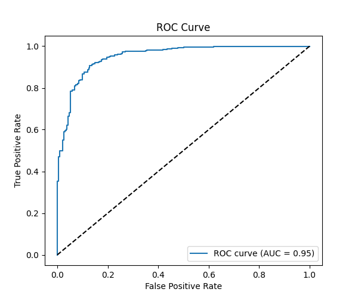
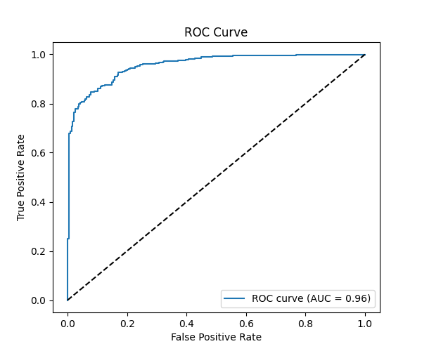

# Pnömoni Tespit Sistemi (Pneumonia Detection System)

Web tabanlı yapay zeka destekli akciğer röntgeni analiz sistemi.

## 🎯 Özellikler

- **Yapay Zeka Analizi**: MobileNetV2 tabanlı derin öğrenme modeli (%90-95 doğruluk)
- **Grad-CAM Görselleştirme**: AI kararlarının görsel açıklaması
- **Hasta Yönetimi**: TC Kimlik No ile hasta kayıt sistemi
- **PDF Raporlama**: Detaylı tarama raporları
- **İstatistik Paneli**: Gerçek zamanlı analiz ve grafikler
- **Arama ve Filtreleme**: Gelişmiş kayıt yönetimi

## 🚀 Kurulum

### Gereksinimler

```bash
Python 3.8+

```

### Adımlar

1. Depoyu klonlayın:
    ```bash
    git clone https://github.com/comandoo-cell/pneumonia-detection-ai.git
    cd pneumonia-detection-ai/X-ray
    ```
2. Sanal ortam oluşturun:
    ```bash
    python -m venv venv
    venv\Scripts\activate  # Windows
    source venv/bin/activate  # Linux/Mac
    ```
3. Bağımlılıkları yükleyin:
    ```bash
    pip install -r requirements.txt
    ```
4. Modelleri yerleştirin:
    - Varsayılan model: `best_model_NEW_TEST.h5`
    - Karşılaştırma için eski model: `best_model.h5`
5. Uygulamayı başlatın:
    ```bash
    python app.py
    ```
6. Tarayıcıda açın: `http://localhost:5000`

## 📁 Proje Yapısı

```
X-ray/
├── app.py                 # Ana Flask uygulaması
├── database.py            # SQLite veritabanı işlemleri
├── gradcam.py             # Grad-CAM görselleştirme
├── pdf_generator.py       # PDF rapor oluşturma
├── train_model.py         # Model eğitim scripti
├── DL.py                  # Alternatif CNN modeli
├── requirements.txt       # Python bağımlılıkları
├── best_model_NEW_TEST.h5 # Varsayılan model
├── best_model.h5          # Eski model (karşılaştırma)
├── evaluate_model.py      # Test değerlendirme scripti
├── chest_xray/            # Kaggle test/val/train veri seti
├── static/
│   ├── css/
│   ├── js/
│   ├── photo/
│   ├── uploads/
│   ├── heatmaps/
│   └── reports/
└── templates/
     ├── index.html
     ├── result.html
     ├── history.html
     └── dashboard.html
```

## 🔬 Teknolojiler

- **Backend**: Flask, TensorFlow, Keras, SQLite
- **Frontend**: HTML5, CSS3, JavaScript, Bootstrap 5, Chart.js
- **AI Model**: MobileNetV2 (Transfer Learning)
- **Visualization**: Grad-CAM, OpenCV
- **Reports**: ReportLab

## 📊 Model Performansı

1 Kasım 2025 tarihinde `evaluate_model.py` scripti `chest_xray/test` veri seti üzerinde çalıştırılarak iki model karşılaştırıldı.

| Model | Accuracy | Precision | Recall | F1-score | ROC AUC |
|-------|----------|-----------|--------|----------|---------|
| `best_model.h5` | 78.0% | 74.2% | 99.5% | 85.0% | 95.7% |
| `best_model_NEW_TEST.h5` | 88.6% | 86.3% | 97.2% | 91.4% | 95.1% |

- `best_model_NEW_TEST.h5` Normal sınıfındaki yanlış pozitifleri %55 azalttı (TN/FP/FN/TP: `[[174, 60], [11, 379]]`).
- `best_model.h5` Pneumonia sınıfında yüksek duyarlılığa rağmen Normal görüntülerde fazla yanlış pozitif üretir (TN/FP/FN/TP: `[[99, 135], [2, 388]]`).
- Sınıf bazlı F1 skorları: eski model Normal = 0.59 / Pneumonia = 0.85; yeni model Normal = 0.83 / Pneumonia = 0.91.

### Görsel Sonuçlar

| Model | Confusion Matrix | ROC Eğrisi |
|-------|------------------|------------|
| `best_model.h5` |  |  |
| `best_model_NEW_TEST.h5` |  |  |

> GitHub üzerinde görseller görünmüyorsa dosyayı yerel olarak açın.

### Tekrar Değerlendirme

```bash
python evaluate_model.py
```

- `model_path` değişkenini düzenleyerek farklı model dosyalarını test edebilirsiniz.
- Çalıştırma sonunda sınıflandırma raporu, karışıklık matrisi ve ROC eğrisi otomatik üretilir.

## 📚 Veri Seti ve Model Eğitimi

- Veri seti: [Chest X-ray Pneumonia Dataset](https://www.kaggle.com/datasets/paultimothymooney/chest-xray-pneumonia)
- Yapı: `train/`, `val/`, `test/` klasörleri; her biri `NORMAL` ve `PNEUMONIA` alt klasörlerine sahiptir.

| Klasör | NORMAL | PNEUMONIA |
|--------|--------|-----------|
| train  | 1341   | 3875      |
| val    | 8      | 8         |
| test   | 234    | 390       |

- Görüntüler 224x224 piksele ölçeklendi.
- Veri artırımı (flip, rotate, zoom, brightness) uygulandı.
- Sınıf dengesizliği için `class_weight` / oversampling kullanıldı.
- Eğitim parametreleri: Epoch 10-20, batch size 32, learning rate 1e-4 (Adam).
- En iyi ağırlıklar doğrulama başarımına göre kaydedildi.

## 🎨 Özellikler Detayı

1. **Tarama Analizi**: Röntgen yükleme, anlık AI tahmini, güven skoru, Grad-CAM ısı haritası
2. **Hasta Yönetimi**: TC Kimlik No ile kayıt, hasta bilgileri, tarama geçmişi
3. **Raporlama**: PDF rapor, ısı haritası, tıbbi tavsiyeler, yasal uyarılar
4. **Dashboard**: Toplam tarama, sınıf dağılımı, zaman çizelgesi, son işlemler

## ⚠️ Önemli Notlar

- Sistem eğitim ve araştırma amaçlıdır.
- Profesyonel tıbbi teşhisin yerini alamaz.
- Kesin tanı için uzman hekime danışılmalıdır.

## 📄 Lisans

Bu proje eğitim amaçlı geliştirilmiştir.

---

**Uyarı**: Bu uygulama profesyonel tıbbi teşhisin yerini almaz.
- Hasta bilgileri (ad, yaş, cinsiyet, telefon)
