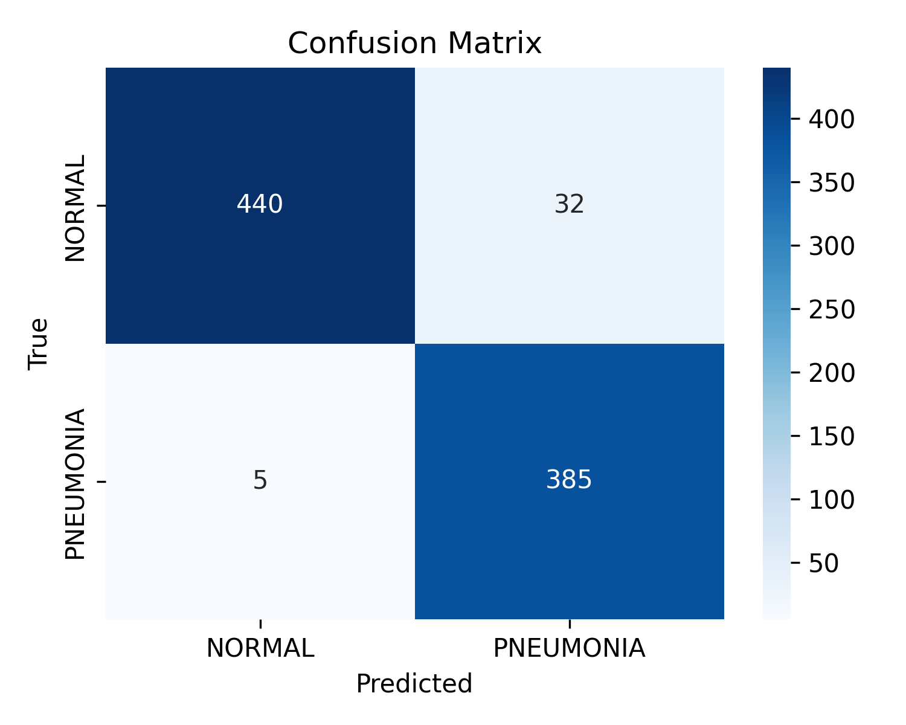
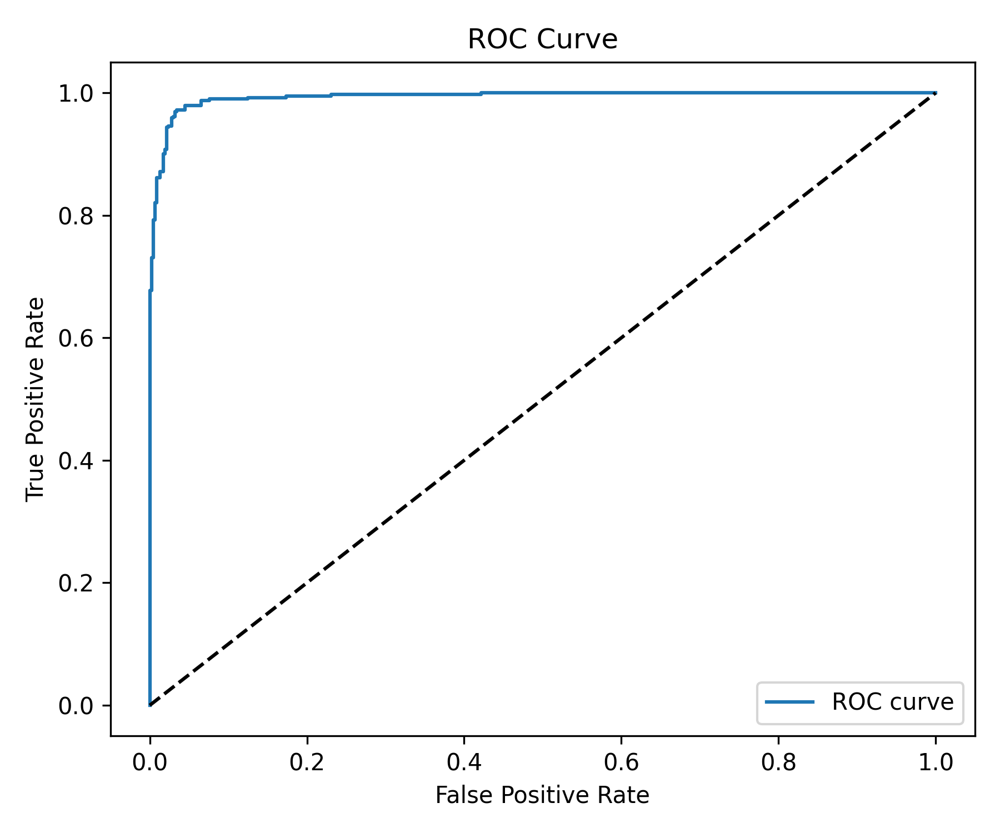

# Pneumonia Detection System (EfficientNetV2 Edition)

Gögüs röntgenlerinde pnömoni tespiti için geliştirilmiş Flask tabanlı web uygulaması. Sistem, EfficientNetV2 tabanlı yeni model ve genişletilmiş, dengeli veri seti sayesinde yüksek doğrulukla iki sınıf ayrımı (NORMAL / PNEUMONIA) yapar.

## ✨ Öne Çıkanlar

- **Güncel Model**: EfficientNetV2-B0 + ince ayar (val PR-AUC 0.997, test doğruluğu %95.7)
- **Daha Dengeli Veri Seti**: 6.321 eğitim, 488 doğrulama ve 862 test görüntüsü; doğrulama seti tamamıyla dengeli (244/244)
- **Grad-CAM Açıklamaları**: Her tahmin için ısı haritaları oluşturulur
- **Hasta Kaydı ve Raporlama**: SQLite veri tabanı, PDF rapor üretimi, filtrelenebilir geçmiş
- **Kolay Değerlendirme**: `evaluate_model.py` varsayılan olarak yeni modeli, uygun ön işlemeyi ve eşik değerini kullanır

## 🚀 Kurulum

```bash
git clone https://github.com/comandoo-cell/pneumonia-detection-ai.git
cd pneumonia-detection-ai/X-ray

python -m venv .venv
.venv\Scripts\activate  # Windows
# source .venv/bin/activate  # macOS / Linux

pip install -r requirements.txt
```

Varsayılan model dosyası (`best_model_STRONG.h5`) repo kök dizininde bulunur; ekstra indirme gerekmez.

## ▶️ Kullanım

```bash
python app.py
```

Uygulama açıldıktan sonra tarayıcıdan `http://localhost:5000` adresini ziyaret edin. Yüklenen her görüntü için model çıktısı, güven skoru ve Grad-CAM ısı haritası gösterilir. Sistem sonuçları SQLite veritabanına kaydedip PDF raporu oluşturabilir.

## 🧠 Model ve Eğitim

- **Mimari**: EfficientNetV2-B0 (ImageNet ağırlıkları, 300×300 giriş)
- **Augmentasyon**: RandomFlip, RandomRotation, RandomZoom, RandomTranslation, RandomContrast
- **Regularization**: Label smoothing, Dropout, L2 ceza, ReduceLROnPlateau, EarlyStopping
- **Sınıf Dengesi**: Güncel veri setinde train oranı NORMAL 2.446 / PNEUMONIA 3.875 (class weight uygulanır)
- **Eşik Değeri**: 0.45 (validation Fβ=0.7 optimizasyonu)

Eğitim scripti:

```bash
python train_strong_model.py --dataset-root chest_xray \
    --artifact-dir outputs/strong_model \
    --model-path ../best_model_STRONG.h5
```

Eğitim sonrası yeni ağırlıklar `best_model_STRONG.h5` dosyasına yazılır, eğitim eğrileri ve raporlar `outputs/strong_model/` altında toplanır.

## 📊 Performans (Test Seti – 472 NORMAL / 390 PNEUMONIA)

| Metric | NORMAL | PNEUMONIA |
| --- | --- | --- |
| Precision | 98.88% | 92.33% |
| Recall | 93.22% | 98.72% |
| F1-score | 0.960 | 0.954 |

- Toplam doğruluk: **%95.71**
- Macro F1: **0.957**
- Önerilen karar eşiği: **0.45**

Görseller (`outputs/strong_model/`):

| Confusion Matrix | ROC Curve |
| --- | --- |
|  |  |

Detaylı rapor: `outputs/strong_model/best_model_STRONG_updated_classification_report.json`

## 🧪 Değerlendirme Scripti

```bash
python evaluate_model.py \
    --model-path ../best_model_STRONG.h5 \
    --test-dir chest_xray/test \
    --output-dir outputs/strong_model
```

- Varsayılan ayarlar EfficientNetV2 preprocess (300×300) ve threshold=0.45 kullanır.
- Çıktılar: sınıflandırma raporu (JSON), karışıklık matrisi, ROC eğrisi.

## 📁 Dizim

```
X-ray/
├── app.py                 # Flask API + arayüz
├── database.py            # SQLite işlemleri
├── evaluate_model.py      # Test değerlendirme scripti
├── gradcam.py             # Grad-CAM üretimi
├── pdf_generator.py       # PDF rapor motoru
├── train_strong_model.py  # EfficientNetV2 eğitim scripti
├── chest_xray/            # Güncel train/val/test verileri
├── static/                # CSS, JS, yüklenen görseller, ısı haritaları
├── templates/             # Flask şablonları
└── pneumonia_detection.db # Lokal veritabanı (opsiyonel)
```

## 📈 Veri Seti Özeti

| Split | NORMAL | PNEUMONIA | Toplam |
| --- | --- | --- | --- |
| train | 2.446 | 3.875 | 6.321 |
| val | 244 | 244 | 488 |
| test | 472 | 390 | 862 |

Veriler, orijinal Kaggle setinin (Mooney) temizlenmiş versiyonu ile ek NORMAL/PNEUMONIA örneklerinin dengeli şekilde dağıtılmasıyla oluşturuldu.

## ⚠️ Uyarı

Bu uygulama eğitim ve araştırma amaçlıdır, profesyonel tıbbi teşhisin yerini alamaz. Nihai karar için mutlaka uzman hekime danışın.
